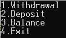

# Bank simulator

## Description

Bank simulator is a console app written in C# that simulates a banking system. You can login to your account, withdrawal, deposit and check you balance.

## Usage
- Make sure you have the latest Visual Studio version installed to your computer [Visual Studio download](https://visualstudio.microsoft.com/downloads/).

- Double click on **bank_simulator.sln** in order for Visual Studio to open the project.

- Click on start button in Visual Studio.

- Program is running.

- Use any of the following accounts.
  
  | **Name** | **Taxpayer Identification Number** | **PIN number** | **Balance** |
  | ---- | ---- | ---- | ---- |
  | Jack Reach | 123456789 | 0123 | 5,000.00 |
  | Janet Bet | 987654321 | 6666 | 20.00 |
  | Carol Ober | 111111111 | 1111 | 100.00 |
  | Jane doe | 555566666 | 5566 | 555.00 |
  | John Doe | 222222222 | 2222 | 222,222.00 |

## License

[MIT](https://choosealicense.com/licenses/mit/)
